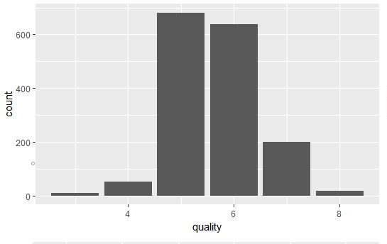
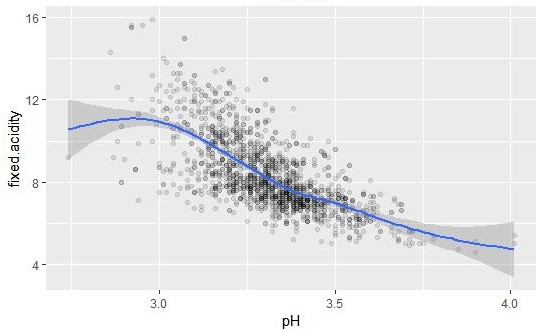

# sf_study
study for Spring Framework

1주차 (2020.08.06 ~ 2020.08.10)<hr/>
---
##### 1. 개발 환경 세팅
- jdk/tomcat/mybatis, eclipse 설치 및 예제 수행
- PropertyNotFoundException 에러 발생 :
    - get, set 함수명을 칼럼명과 똑같이 설정해야 함. 대소문자 구분은 상관없는 듯 하나, jsp 파일에서는 멤버변수가 소문자로 시작해야 하는 듯 함.
- root-context.xml에서 bean을 찾을 수 없다는 에러가 발생 :
    - root-context.xml에서 xsi:schemaLocation에 해당 bean의 라이브러리?를 추가해야 하는 듯 함
    
##### 2. github 계정 생성
- <https://github.com/cumulus-kdy/sf_study.git>


2주차 (2020.08.06 ~ 2020.08.10)<hr/>
---
##### 1. 차트 테스트
- chart_test 프로젝트 생성 후 WebContent 하위에 example.html, data.tsv 생성

##### 2. api가이드
- example1
</img><br/>
```json
{
	x_title : "quality",
	y_title : "count",
	array : [
				{quality : 3, count : 4},
				{quality : 3, count : 4},
				...
				{quality : 3, count : 4}
	]
}
```
- example2 (시간 남으면 할 예정)
</img><br/>
```json
{
	x_title : "pH",
	y_title : "fixed acidity",
	array : [
	{ph : 3, fa : 4},
	{ph : 3, fa : 4},
	...
	{ph : 3, fa : 4}
	]
}
```
