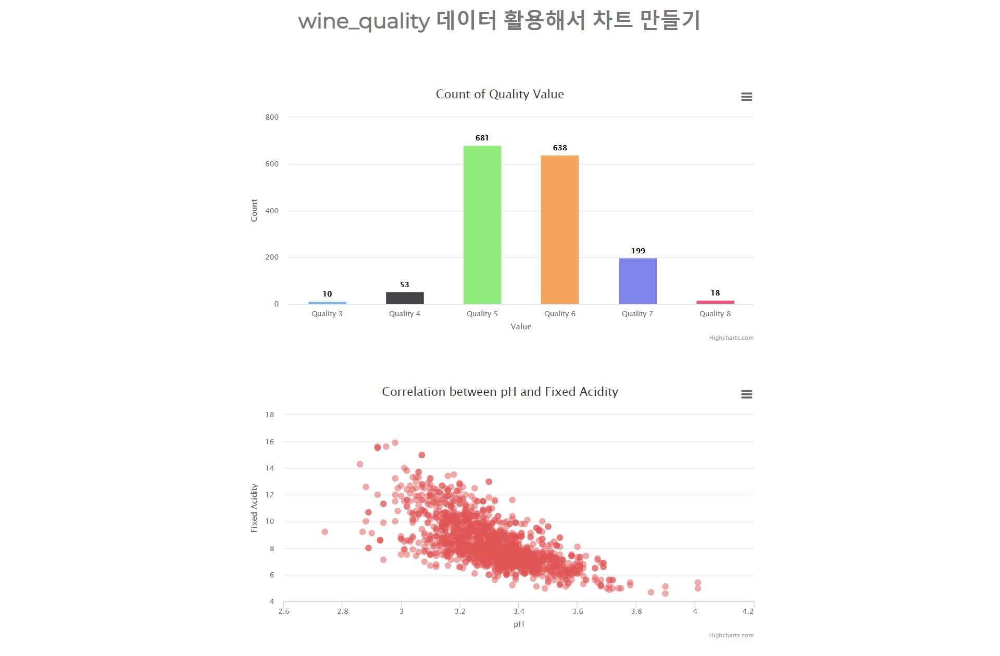

# sf_study
study for Spring Framework  

1주차 (2020.08.06 ~ 2020.08.10)

##### 1. 개발 환경 세팅
		1) jdk/tomcat/mybatis, eclipse 설치 및 예제 수행
		2) PropertyNotFoundException 에러 발생 :
    		- getter, setter 함수명을 칼럼명과 똑같이 설정해야 함.
		3) root-context.xml에서 bean을 찾을 수 없다는 에러가 발생 :
    		- root-context.xml에서 xsi:schemaLocation에 해당 bean을 추가해야 함
    
##### 2. github 계정 생성
- <https://github.com/cumulus-kdy/sf_study.git>
    

2주차 (2020.08.13 ~ 2020.08.17)

##### 1. 차트 테스트
		1) chart_test 프로젝트 생성 후 WebContent 하위에 example.html, data.tsv 생성

##### 2. 인터페이스 가이드 작성 및 업로드
    

3주차 (2020.08.20 ~ 2020.08.24)

##### 1. RestController 활용한 DataBinding
		1) Jackson 라이브러리 추가
		2) restController.java 작성
		3) home.jsp 작성
		4) common_resource.jsp / home.js / home.css 작성
		5) jquery-1.12.4.min.js 추가
    

4주차 (2020.08.27 ~ 2020.08.31)

##### 1. 차트 선정
		- quality 값의 개수를 보여주는 Bar Chart
		- pH와 fixed acidity 간의 상관관계를 나타내는 Scatter Plot
##### 2. Database 세팅
		- 테이블 product_quality 생성 후 wine_quality.csv에 있는 데이터 입력
##### 3. 데이터 조회 및 처리를 위한 클래스 작성
		- WineQDAO.java, WineQService.java, QCountVO.java, pHAcdVO.java, RestController.java 등 작성
		- 페이지 로딩 시 ajax로 해당 데이터 수신 후 차트 생성.
##### 4. 차트 구현
